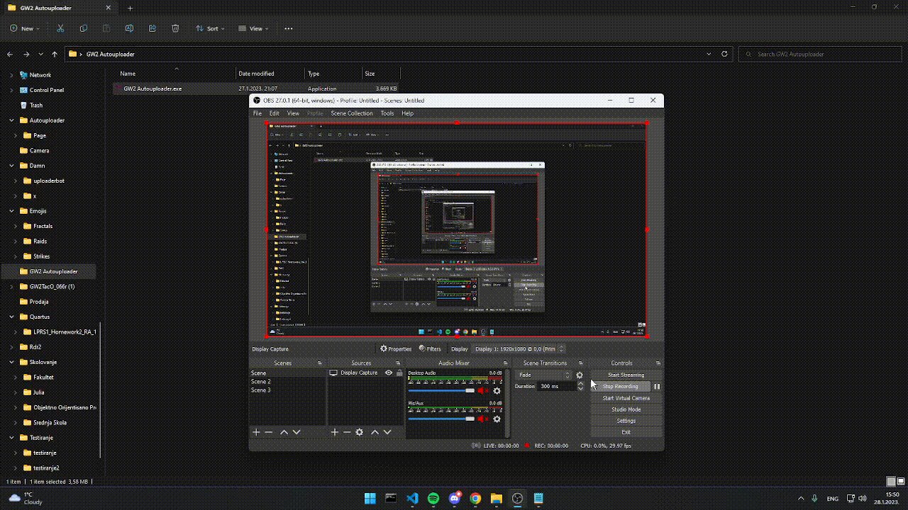
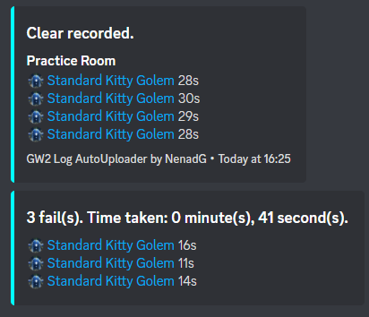

# GW2 Autouploader
An autouploader tool that automatically uploads `arcdps` `.zevtc` files to [dps.report](https://dps.report/) website, and proceeds to send your files to a discord webhook you chose.

## How to use?
### Initial Startup

1. Starting the application, you will be asked to choose a **valid** directory where your `.zevtc` files are stored.
2. You choose the directory, and are prompted with another window where you will input a discord webhook of your choosing.
3. After that, it will store that data in `path.json` file, it will load data from there always.

### Using the program
There's a couple of buttons in the main window frame. 

1. Change folder - gives you a prompt to reenter your directory where logs are saved.
2. Change webhook - gives you a prompt to reenter your link to your webhook. You can use this to send logs into a different channel.

## Recording files
There's two ways to record files:

1. *Single file recording* - every recorded file is sent separately into the webhook channel.
2. *Multiple file recording* - all files are stored, and then sent in the end to the webhook channel in a nice embed.

Any way you choose to record the files, the files will be stored.

## Single file recording
1. Press record...
2. Enjoy your logs! :)

Results in:

## Multiple file recording
1. Press multiple files record...
2. In the end, press stop recording.
3. Enjoy your pretty embed of files!

Results in:

# Prerequisites
it's very important you have (at least) JAVA JDK 17.0!

Libraries used

1. [Java SWING](https://en.wikipedia.org/wiki/Swing_(Java)) (for GUI design)
2. [MinnDevelopment - discord-webhook](https://github.com/MinnDevelopment/discord-webhooks) (for sending files to discord)
3. [Gson](https://github.com/google/gson)
4. [Unirest](http://kong.github.io/unirest-java/) (for handling http requests to APIs)